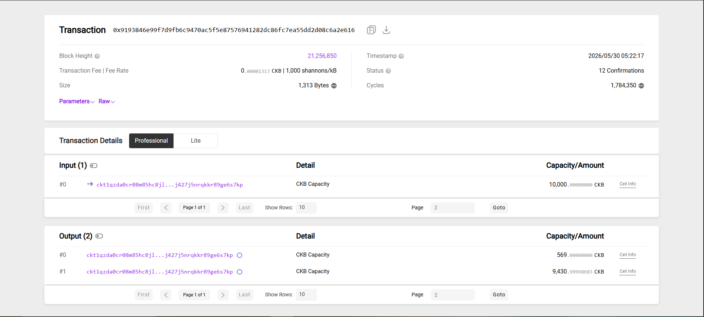
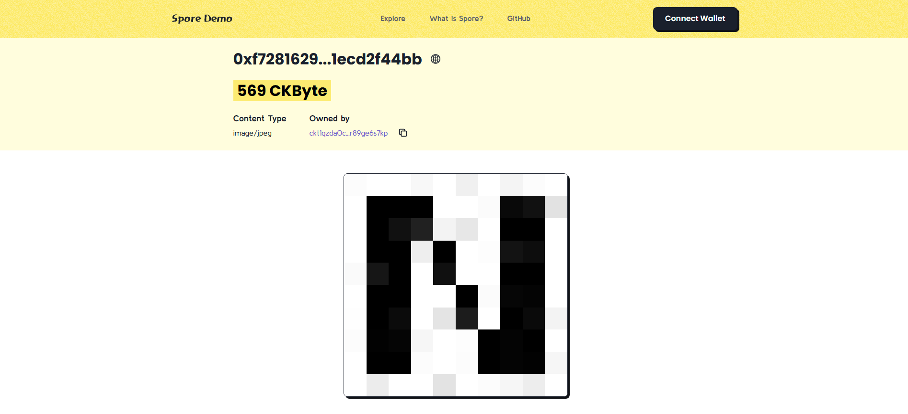
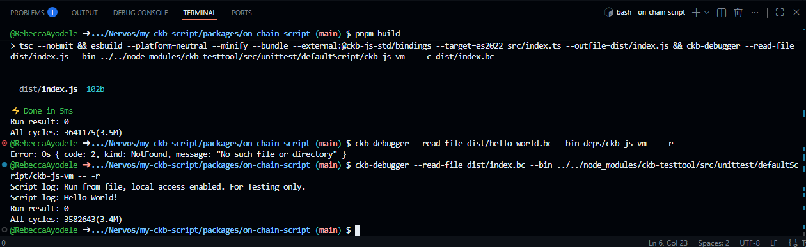
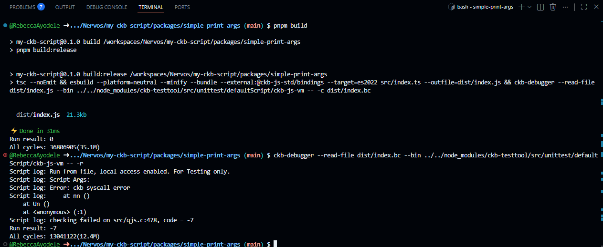

## Builder Track Weekly Report — Week 10

**Name:** Rebecca Ayodele
**Week Ending:** 05-30-2026

---

### Courses Completed

- **JS Scripting**:
  - [JavaScript Quick Start](https://docs.nervos.org/docs/script/js/js-quick-start)
  - [JS VM: Mechanism and Capabilities](https://docs.nervos.org/docs/script/js/js-vm)
  - [JS VM Build](https://docs.nervos.org/docs/script/js/js-vm-build)
  - [JS VM Command-Line Options](https://docs.nervos.org/docs/script/js/js-vm-cmd-line-options)
  - [JS VM Security](https://docs.nervos.org/docs/script/js/js-vm-security)
  - [JS VM File System](https://docs.nervos.org/docs/script/js/js-vm-file-system)
  - [JS VM Injecting Functions](https://docs.nervos.org/docs/script/js/js-vm-injecting-function)

- **Spore Protocol**:
  - [Spore Protocol Tutorials](https://docs.spore.pro/category/tutorials)
  - [Create Your First Spore — Tutorial](https://docs.spore.pro/tutorials/create-first-spore/)
  

---

### Key Learnings

**JS VM Overview:**

The CKB JavaScript VM allows JavaScript to run inside the Nervos CKB blockchain environment. It is built on QuickJS, a lightweight JavaScript engine, and QuickJS runs on top of CKB-VM which is based on RISC-V. This means JavaScript does not run directly on the blockchain VM — it runs inside QuickJS first, and QuickJS runs inside CKB-VM. This design makes JavaScript easier to use for writing scripts but it still follows the strict rules of blockchain execution. It is mainly used for writing and testing CKB scripts in a higher-level language compared to Rust or C.

**JS VM Build:**

The JS VM is not used as a standalone tool. It has to be built into a binary using Rust tooling like Cargo because part of the system is implemented in Rust. During the build process, the VM is compiled into something that can run inside the CKB environment. After building, the output is used together with `ckb-debugger`, which is the main tool for running and testing scripts locally before deploying them to the blockchain. The build step ensures the JavaScript runtime works correctly within the CKB execution system.

**Command-Line Options:**

The JS VM provides command-line options that are mainly used for testing through tools like `ckb-debugger`. The `-e` option allows JavaScript code to be executed directly from the terminal without needing a full project setup. The `-c` option compiles JavaScript into bytecode, which improves execution speed compared to running raw JavaScript. These options are not meant for general JavaScript development — they are tightly connected to the CKB debugging workflow, where scripts need to be tested in a controlled blockchain-like environment before deployment.

**Security:**

Security in the JS VM is based on strict sandboxing because blockchain execution must be deterministic. The VM prevents JavaScript from accessing system resources like the operating system, network, or external processes. This is important because even small unpredictable behaviour could break consensus across the network — every node must produce the same result when executing the same script. The JS VM is designed to keep execution safe, isolated, and predictable under all conditions.

**File System:**

The file system in the JS VM is a virtual file system, not a real operating system file system. It allows JavaScript code to be organized into modules and multiple files, making it easier to manage larger projects by splitting logic into separate parts and importing them when needed. It works similarly to module systems in Node.js but is more limited because it runs inside a controlled blockchain environment.

**Function Injection:**

Function injection is how JavaScript code connects with the underlying CKB system. Instead of JavaScript directly accessing blockchain data, native functions written in lower-level languages like Rust are injected into the runtime. These injected functions act as a bridge between JavaScript and the blockchain environment, allowing scripts to access transaction data, script arguments, and other CKB-specific information that normal JavaScript would not be able to reach on its own.

**JS VM vs Native Scripts:**

Native CKB scripts written in Rust or C run directly on CKB-VM and are faster and closer to the system level. JavaScript scripts go through an extra layer — JavaScript runs inside QuickJS first, and then QuickJS runs on CKB-VM. This adds overhead but makes development more accessible. One practical difference is in how script arguments are handled. In native scripts, script args are usually 32 bytes. In the JS VM environment, they appear as 35 bytes because the extra 3 bytes are used for internal metadata so the VM loader can correctly interpret the script execution. This is why the quick start code does `.args.slice(35)` to get to the actual args.

**Spore Protocol:**

Spore Protocol is built on top of Nervos CKB and is used to create digital objects (DOBs), fully on-chain assets where all data is stored directly on the blockchain instead of being hosted externally. This connects directly to the CKB cell model, where data is stored in cells that are created and consumed rather than edited.

Each Spore is backed by CKBytes, which gives it intrinsic value beyond just market demand. Because of this, a Spore can be melted back into CKBytes at any time. The object is destroyed and its underlying capacity is recovered. This is different from normal NFT systems where value is purely market-based.

Once a Spore is created its metadata cannot be changed, which is consistent with how CKB cells work. Data is immutable and updates require creating a new cell instead of modifying an existing one. Spore also handles transfers differently from most blockchain assets. Each Spore carries its own CKByte capacity, so users do not need to hold separate gas fees before interacting with assets.

Clusters are another structure in Spore, a way to group multiple Spores under a shared identity. Each Spore can belong to only one cluster, but a cluster can contain many Spores. This is useful for organizing digital objects that belong to the same project or collection.

The Spore ID itself is derived from the first input's OutPoint using the same Type ID mechanism from class 6, which ensures every Spore has a unique and non-replicable identifier.

---

### Practical Progress

**Create DOB — Spore Protocol**

Cloned the [`spore-first-example`](https://github.com/sporeprotocol/spore-first-example) repository into Codespace, installed dependencies, and created a Spore on testnet with an image stored fully on-chain.

Spore created at: ```https://pudge.explorer.nervos.org/transaction/0x9193846e99f7d9fb6c9470ac5f5e87576941282dc86fc7ea55dd2d08c6a2e616```
Spore ID: 0xf72816299404bcbb120b4b6aed862fcd33d3f51a55bc87c5ddfdb71ecd2f44bb




**JS Quick Start — Hello World**

Scaffolded a new project using `pnpm create ckb-js-vm-app`, modified `src/index.ts` to print Hello World, built it and ran it through `ckb-debugger`.



**JS Quick Start — Simple Print Args**

Duplicated the Hello World project and replaced the contract with the simple-print-args example that reads script args and witness data using `HighLevel.loadScript()` and `HighLevel.loadWitnessArgs()`. Built and ran it. The script printed the args correctly but returned error `-7` when trying to load witnesses because `ckb-debugger` runs without a full transaction context — no witnesses exist. This is expected behaviour as described in the docs.



---

### Challenges Faced

- Script course classes 8–10 links were returning page not found — could not complete that reading this week.
- The StackBlitz environment for the Spore tutorial was incompatible with my browser setup, so the tutorial was completed by cloning the repository directly into Codespace instead.

---

### Reflection

For the `.slice(35)` the first 35 bytes of script args are consumed by the VM loader, so the actual args start after that.

The Spore creation was more straightforward than expected once it was moved out of StackBlitz into Codespace. The connection to Type ID from class 6 was clear — the Spore ID is derived from the first input's OutPoint the same way Type ID works, which is why each Spore ID is unique and cannot be replicated.

---

### Next Week Plan

- Complete script course classes 8–10 if links are restored
- Begin the Detailed Rust scripting quick start
- Read further JS VM documentation — JS API and JS Tests
- Create On-Chain Blog — Spore Protocol