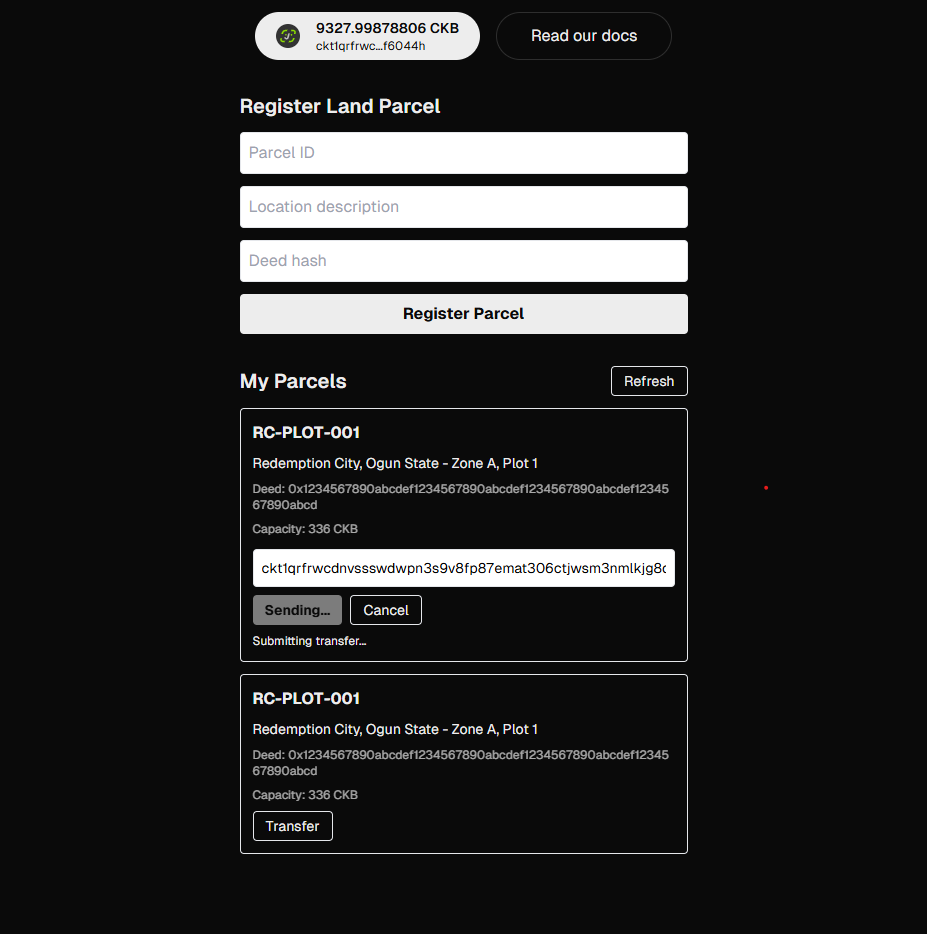
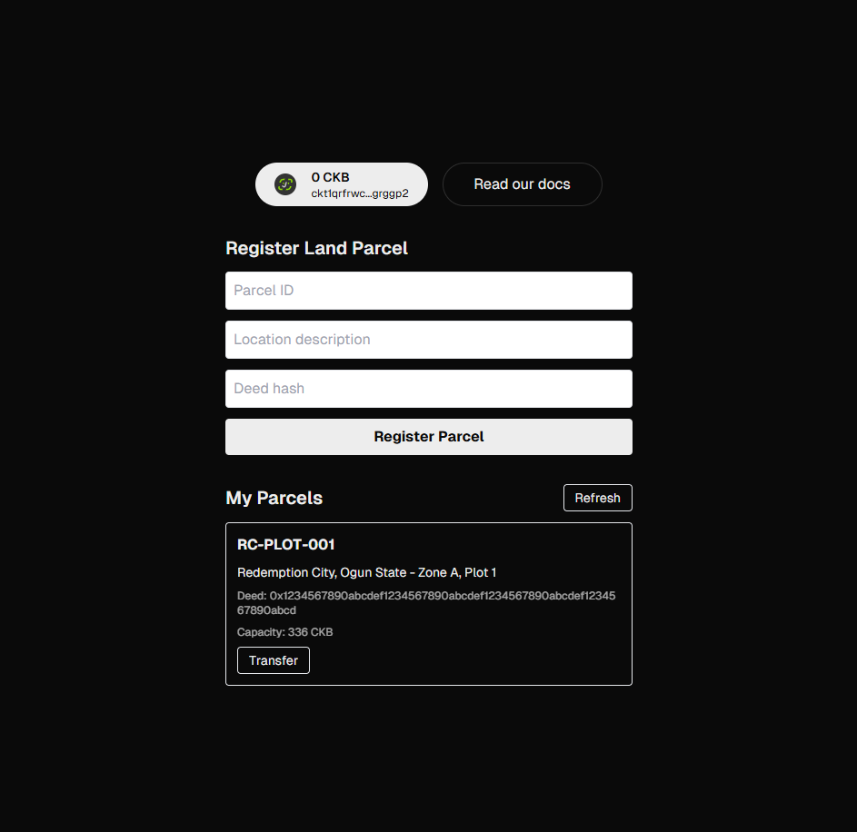
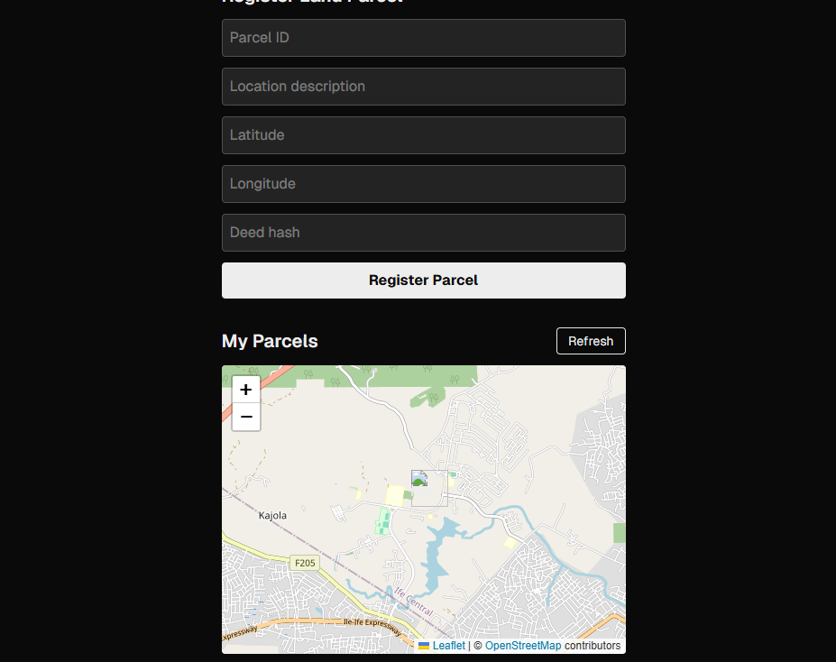

## Builder Track Weekly Report — Week 12

**Name:** Rebecca Ayodele
**Week Ending:** 06-15-2026

---

### Courses Completed

Pure building this week, no new course material covered.

---

### Practical Progress

##### Link to github project: '''https://github.com/RebeccaAyodele/land-ledger'''

**LandLedger — Environment Setup**

Started building LandLedger, a land title registry on CKB testnet built with the CCC SDK, as my CKBBuilder capstone and portfolio project. This is a Next.js app where land parcels are registered as CKB cells, with the owner's lock script controlling who holds the parcel and ownership transfers happening by consuming the old cell and creating a new one with the new owner's lock script.

My previous laptop was ARM-based and couldn't compile Rust natively, so anything Rust-related had to be done through Codespace. With the new laptop I set everything up from scratch on Windows using WSL2 with Ubuntu 24. Installed Rust via rustup, Node LTS, and pnpm. Ran into a few setup issues along the way:

- pnpm kept resolving to the Windows binary instead of the Linux one inside WSL, because the PATH was picking up Windows paths first. Fixed by reordering PATH in `.bashrc` and reinstalling pnpm with the correct global prefix.
- VS Code was editing the project through the Windows filesystem path instead of a proper WSL remote window, which caused widespread TypeScript errors (JSX IntrinsicElements not found across the whole project even though the types were installed correctly). Fixed by reopening the folder in WSL.

Once the environment was sorted, scaffolded the project with `create-ccc-app`, confirmed wallet connection works with JoyID.

**LandLedger — Register Parcel**

Built a hook that takes land parcel data (parcel ID, location, latitude, longitude, deed hash, owner address) and encodes it as JSON, then converts it to bytes for storage in a CKB cell's data field. The transaction creates one output cell with the signer's lock script and the encoded data, then uses `completeInputsByCapacity` and `completeFeeBy` to handle capacity and fees automatically.

Built a form UI to collect parcel details and submit the transaction. First test failed with "Insufficient CKB, need 336 extra CKB" because the address I'd funded from the faucet wasn't the same address JoyID had connected with. Once I funded the correct address, registration succeeded on testnet.

The 336 CKB requirement comes from the minimum 61 CKB cell capacity plus the byte length of the JSON data, which is dominated by the owner's address string (about 95 characters).

**LandLedger — View Parcels**

Built a hook that queries all cells owned by the connected wallet using `findCells`, decodes each cell's data as JSON, and filters to only the ones matching the LandParcel shape (skipping plain CKB cells with no relevant data). Initial version included `scriptType` and `scriptSearchMode` fields in the filter object, which caused a type error since those fields belong to a different type than the one `findCells` accepts. Removed them and passed an empty filter, since `findCells` on a signer already scopes to that signer's own cells.

Built a component to display the list with a refresh button. Confirmed the registered parcel shows up correctly with its details and capacity.

**LandLedger — Transfer Ownership**

Built a hook that takes an existing parcel's outpoint, its current data, and a new owner's address, resolves the new owner's lock script from their address, updates the `owner` field in the parcel JSON, and builds a transaction that consumes the old cell and creates a new one with the new lock script and updated data.

Added a transfer UI to each parcel card with an input for the recipient address and a confirm button. Tested with a second testnet address and confirmed the transfer transaction succeeds and the parcel cell moves to the new owner.

**LandLedger — Map Visualization**

Extended the LandParcel data model to include latitude and longitude fields, updated the register form to collect coordinates. Installed Leaflet and react-leaflet to render parcels on a map.

Hit a runtime error, "render is not a function," when trying to display the map. The cause was a version mismatch: react-leaflet v5 requires React 19, but the project is on React 18.3.1. Downgraded to react-leaflet v4.2.1, which supports React 18, and the map rendered correctly with markers for registered parcels.

---

### Challenges Faced

- Setting up WSL2 from scratch on the new laptop, since the previous ARM laptop couldn't compile Rust at all. Most of the friction was PATH and filesystem path issues between Windows and WSL rather than CKB-specific problems.
- Sending testnet CKB to the wrong address initially because the faucet address from an earlier project didn't match the address JoyID connected with on this new setup.
- Dependency version mismatches (react-leaflet vs React 18) that needed a downgrade to resolve.

---

### Reflection

Phase 1 of LandLedger (register, view, and transfer land parcels as CKB cells) is working end to end on testnet. The core idea, that ownership records are immutable cells and transfers require consuming the old cell and creating a new one, maps cleanly onto the land registry use case. Most of this week's time went into environment setup rather than CKB-specific logic, but the actual CCC SDK calls (`completeInputsByCapacity`, `completeFeeBy`, `findCells`, `Address.fromString`) worked as expected once the right method signatures were confirmed against the installed package types.

---

### Next Week Plan

- Polish LandLedger UI and clean up remaining rough edges
- Explore Molecule serialization for structured land data instead of plain JSON
- Look into a custom type script for transfer rules (e.g. multi-party approval) as a Phase 2 stretch goal