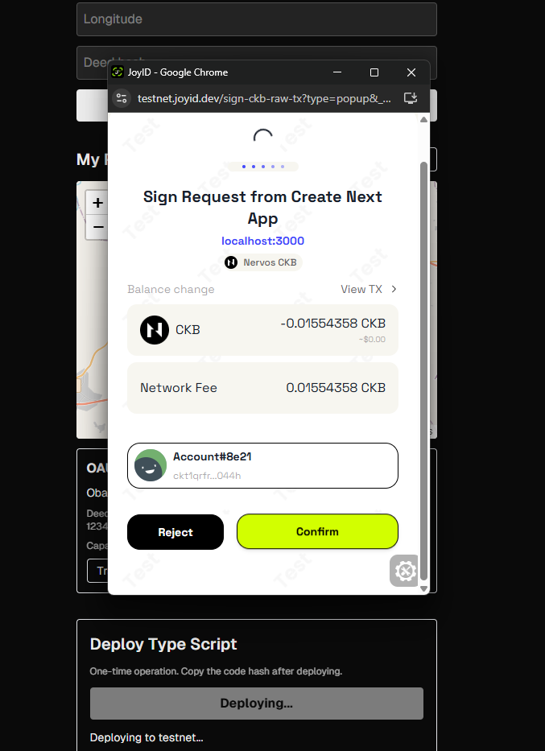
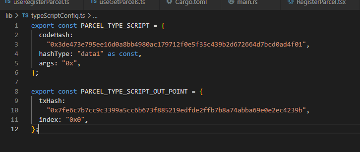

## Builder Track Weekly Report — Week 13

**Name:** Rebecca Ayodele
**Week Ending:** 06-19-2026

---

### Courses Completed

Pure building this week, no new course material covered.

---

### Practical Progress

##### Link to github project: https://github.com/RebeccaAyodele/land-ledger

**LandLedger — Molecule Serialization**

Replaced the JSON encoding approach with Molecule serialization for storing land parcel data in CKB cells. Added `@ckb-lumos/codec` as a dependency and created a codec file (`lib/parcelCodec.ts`) that defines a Molecule table for the `LandParcel` type with six fields: parcelId, location, latitude, longitude, deedHash, and owner.

Each variable-length string field uses `byteVecOf` with a custom pack/unpack implementation. Numbers (latitude and longitude) are stored as UTF-8 strings inside a byteVec, which keeps the codec simple while still using the Molecule binary format. The encode and decode functions (`encodeParcel` and `decodeParcel`) replace the previous `JSON.stringify` and `JSON.parse` calls in the register and view hooks respectively.

During the migration, old JSON-encoded cells threw "Invalid buffer size" errors when the decoder tried to parse them as Molecule. Fixed by wrapping `decodeParcel` in a try/catch inside `useGetParcels.ts` so non-Molecule cells are silently skipped.

**LandLedger — Rust Type Script**

Wrote a custom CKB type script in Rust that enforces parcel ID immutability during ownership transfers. The rule is: when a parcel cell is consumed in a transaction, the output cell must contain the same parcelId. This prevents anyone from changing a parcel's identity during a transfer, which would be a form of record tampering.

The script manually parses the Molecule table binary format to extract the parcelId field from cell data, using the table header offsets (4 bytes total size + 6 field offsets × 4 bytes each = 28 byte header). It collects parcelIds from all input cells and output cells that carry the same type script hash, then verifies every input ID appears in the outputs.

Set up the project as a Rust binary crate targeting `riscv64imac-unknown-none-elf` (CKB's RISC-V target), using `ckb-std v0.16` for CKB system calls. Required installing `gcc-riscv64-unknown-elf` as a cross-compiler. The binary compiled successfully to 45KB.

**LandLedger — Type Script Deployment**

Deployed the compiled binary to CKB testnet by creating a cell with the binary as cell data from the frontend. The binary is served from the Next.js `/public` folder, fetched as an ArrayBuffer, converted to hex, and sent as a transaction output using the connected wallet.

Deploying a 45KB binary required approximately 46,000 testnet CKB (1 CKB per byte of cell data plus the base 61 CKB cell capacity). This required claiming from the faucet multiple times before the deployment went through.

The deployed code hash and outpoint were saved to `lib/typeScriptConfig.ts` and referenced in `useRegisterParcel.ts` and `useTransferParcel.ts` so every new parcel cell carries the type script.

Registered a new parcel (OAU-PLOT-004) with the type script attached — transaction confirmed on testnet, confirming the Rust script is now enforcing transfer rules on-chain.

---

### Challenges Faced

- Getting `@ckb-lumos/codec`'s `byteVecOf` type signatures right — the `unpack` function receives `BytesLike` (which includes strings) rather than `Uint8Array`, which required importing `BytesLike` from `@ckb-lumos/codec/lib/base` directly and wrapping input with `bytify()` before passing to `TextDecoder`.
- The `ckb-std::entry!` macro in v0.16 already imports `alloc` internally, so adding `extern crate alloc` manually caused a "defined multiple times" compile error. Removing the explicit extern crate declaration fixed it.
- Deploying the type script binary required ~46,000 testnet CKB due to CKB's 1 CKB per byte capacity rule. This is expected behaviour — in production, script binaries are typically deployed once by the protocol team and shared across users. On testnet, multiple faucet claims were needed to cover the cost.
- Ownership transfer to a different address got stuck on "Submitting transfer..." with no success or error response. The transaction appears to hang at the wallet signing step. This is unresolved and will be investigated next week.

---

### Reflection

The most significant part of this week was writing the Rust type script. The logic itself is straightforward — compare parcel IDs across inputs and outputs — but manually parsing the Molecule binary format in a `no_std` Rust environment (no standard library, no heap by default) required understanding the exact byte layout of a Molecule table. The 28-byte header structure (4 bytes total size + 6 field offsets × 4 bytes) had to be read correctly for the parcelId extraction to work.

The 1 CKB per byte deployment cost is an important property of CKB that is easy to overlook when working on the TypeScript side. It makes deploying even a small script binary expensive relative to what you would expect from an EVM chain, but it also means every byte stored on-chain has real economic weight behind it — which aligns with the land registry use case where data permanence matters.

---

### Next Week Plan

- Investigate and fix the ownership transfer hang when sending to a different address
- Complete type script integration and test a full register → transfer flow with the Rust script running on-chain
- UI polish and final cleanup for LandLedger