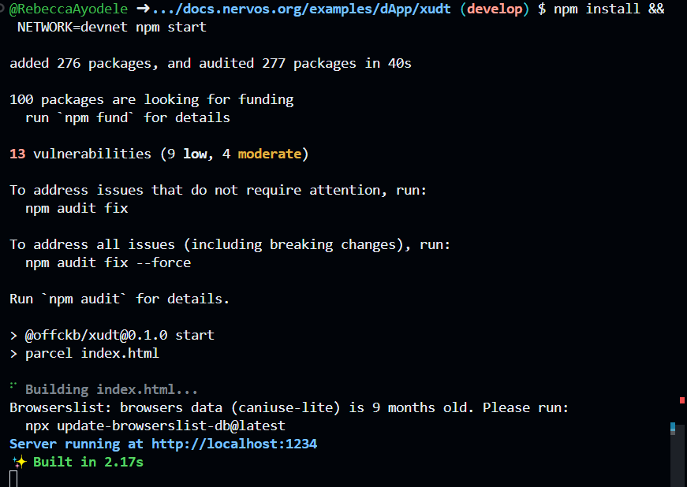
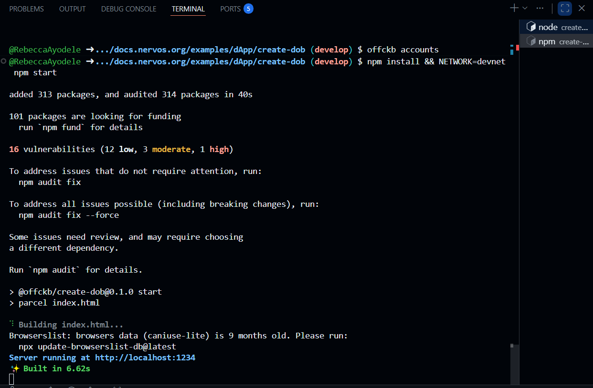
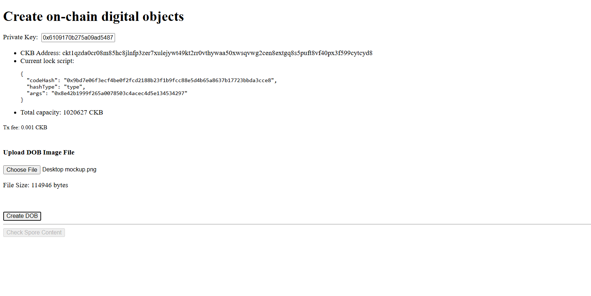
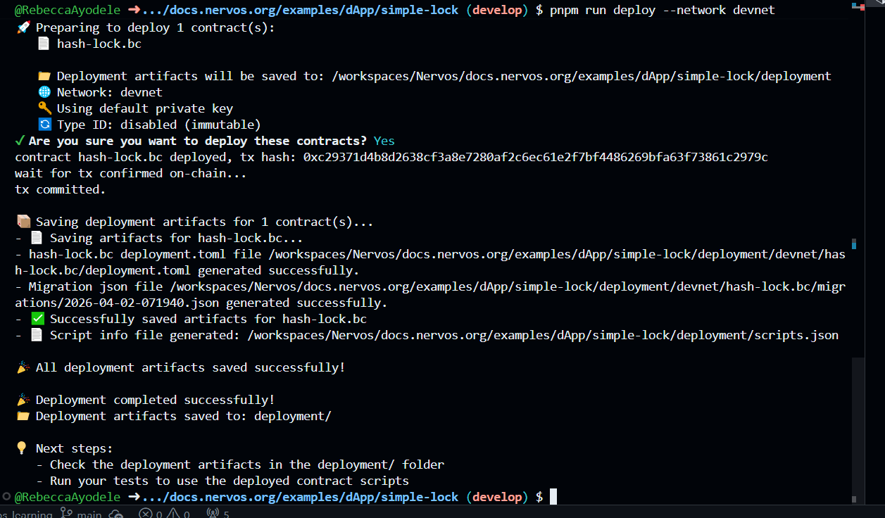
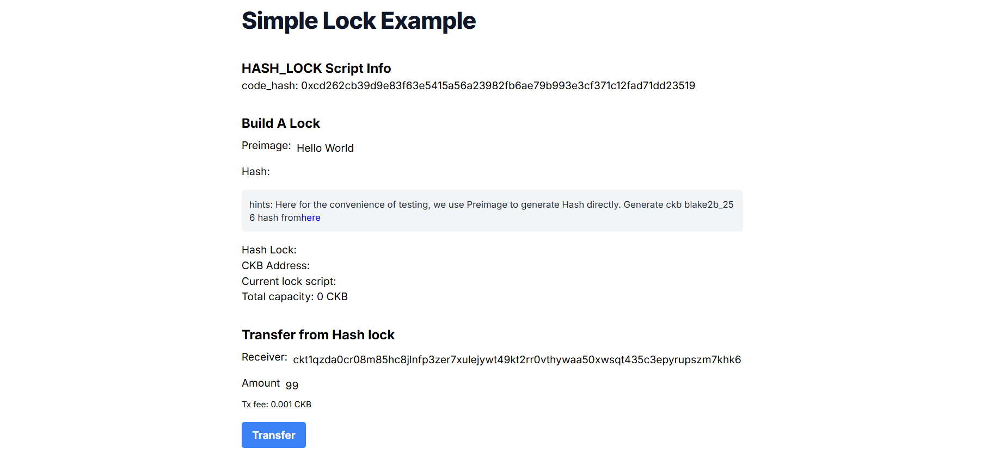

# Builder Track Weekly Report — Week 2

**Name:** Rebecca
**Week Ending:** 04-02-2026

---

## Courses Completed

**Lab Environment Setup – L1 Developer Training Course**

Set up everything needed to start the [L1 Developer Training Course](https://nervos.gitbook.io/developer-training-course/lab-exercise-setup) labs. Installed Node.js, Rust, and Git, then cloned the course materials repo.

**Smart Contract Basics – CKB Docs**

Read through the first four pages of the Smart Contract Basics section: Intro to Script, Program Languages, Syscalls, and Cycle Limits.

**Build DApp Tutorials – CKB Docs**

Ran all five Build DApp tutorials: Transfer CKB, Store Data on Cell, Create a Fungible Token, Create a DOB, and Build a Simple Lock.

---

## Key Learnings

**Scripts, not Smart Contracts**

CKB doesn't call them smart contracts — it calls them Scripts. A script is a small program that runs during a transaction and returns either 0 (pass) or a non-zero number (fail). If it fails, the whole transaction is rejected.

**What a Script actually is**

A script has three parts: a `code_hash` which points to the actual program, a `hash_type` which says how to find it, and `args` which are extra inputs passed to it. The program itself is stored inside a cell's data field. Many people can share the same program but each use it with their own inputs — like how everyone uses the same lock system but with their own key.

**Lock vs Type**

A lock script controls who is allowed to spend a cell. It only runs when someone tries to consume that cell. A type script checks that the rules of an application are being followed — it runs both when a cell is created and when it's consumed. Every cell must have a lock script, but a type script is optional.

**How Scripts Run**

When a transaction is submitted, CKB runs all the scripts attached to the input and output cells. Lock scripts only run for input cells. Type scripts run for both. If any single script fails, the entire transaction is rejected.

**Syscalls**

A script runs in an isolated environment so it can't read data freely. It uses syscalls — built-in functions that let the script ask CKB for specific data like cell contents or transaction details. Without syscalls, a script would be completely blind to the transaction around it.

**Cycle Limits**

Every operation a script does costs cycles — a way to measure how much work it does. CKB puts a cap on how many cycles a script can use per transaction. This stops bad scripts from running forever and keeps the network fair.

**Cell Data Storage**

Storing data in a cell is not free. More data means the cell needs more CKB capacity to exist on chain.

**On-chain NFTs with Spore**

Unlike most NFT systems where only metadata lives on-chain, the Spore Protocol stores the actual content inside the cell itself.

---

## Practical Progress

**Transfer CKB** — Sent CKB between two addresses. Learned that a transfer means destroying old cells and creating new ones, not just moving a number.

**Store Data on Cell** — Stored "Hello CKB!" on-chain inside a cell's data field, then read it back and decoded it.

**Create a Fungible Token** — Created a token using the SUDT standard already deployed on testnet. Used `lib.ts` to understand how to reference a deployed script by hash and build a transaction that follows its rules.

**Create a DOB** — Minted a digital object using the Spore Protocol with real content stored inside the cell.

**Build a Simple Lock** — Ran a `hash_lock` script that protects a cell using a hash. To unlock it, you provide the original value that produces that hash.

[simple lock deposit response](./assets/deposit-response.png)

---

## Environment

- Node.js, Rust, and Git installed.
- OffCKB devnet running locally.
- CCC (JavaScript/TypeScript SDK) set up and working.
- All five DApp tutorial projects cloned and running.

---

## What's Next

- Start the L1 lab exercises.
- Learn Rust properly (already started).
- Learn how to build with CCC.