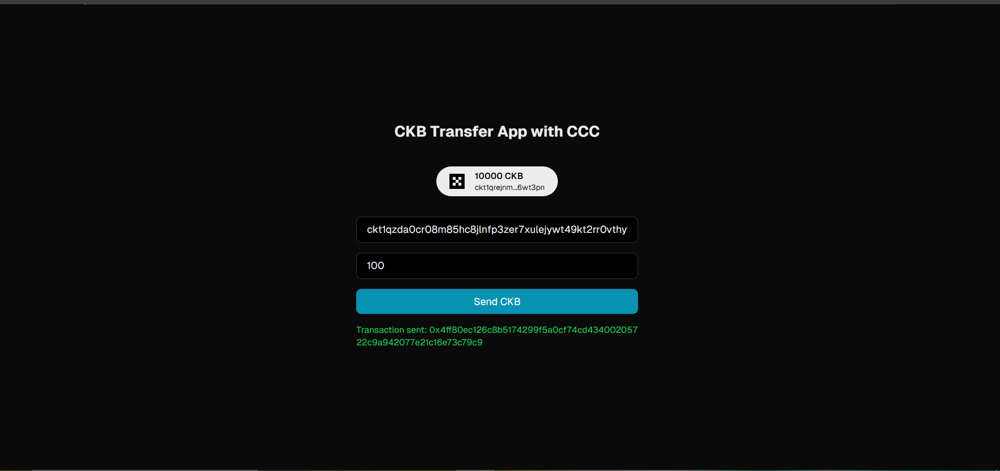

## Builder Track Weekly Report — Week 5

**Name:** Rebecca Ayodele  
**Week Ending:** 04-23-2026  

---

### Courses Completed

- **CCC Documentation & Code Examples**:
  - Transfer CKB
  - Transfer All CKB
  - Sign and Verify a Message
  - Transfer UDT Token

---

### Key Learnings

CCC is a TypeScript SDK that handles the tedious parts of building a CKB transaction automatically. Instead of manually picking input cells, calculating change, and computing fees like I was doing in Lumos, CCC lets you describe what you want the outputs to look like and fills in the rest with methods like `completeInputsByCapacity` and `completeFeeBy`.

Going through each example helped me understand the full transaction building flow:

- **Transfer** — define outputs with a specific amount, CCC finds the right input cells and calculates change automatically
- **TransferAll** — no amount specified, CCC sweeps everything using `completeInputsAll`. Instead of creating a separate change cell, `completeFeeChangeToOutput` subtracts the fee directly from the destination output
- **Sign and Verify** — signing a message with a private key produces a signature that only verifies against that exact message. Passing a wrong message to the verifier fails immediately. This is exactly what lock scripts do under the hood when checking cell ownership
- **Transfer UDT** — unlike a regular CKB transfer, UDT transactions manage two balances at the same time. `udt.completeBy` handles the token inputs separately from `completeInputsByCapacity` which handles the CKB capacity side

One thing that became clear this week is why CCC keeps pulling in extra input cells at the fee stage. Every output cell needs a minimum capacity to exist on chain. If the change after filling inputs is less than that minimum, CCC pulls in another cell to make the change output valid.

The playground does not enforce minimum capacity when building transactions — you can construct a cell with 4 CKB and it will not complain. But switching to mainnet, the node rejects it immediately because validation happens on chain not in the builder.

On the Rust vs TypeScript distinction — everything in the CCC playground is TypeScript. Rust is only for writing the actual on-chain scripts. That separation became much clearer this week.

---

### Practical Progress

- **Ran all 4 official CCC examples** in the playground and understood what each line does before running them

- **Wrote original transaction code** — a multi-output transaction sending 100 CKB to one address and 50 CKB to a different address in a single transaction

  

- **Stored data in a cell** — converted "Becca" to hex using `TextEncoder` and stored it as cell data in an output

- **Tested minimum capacity enforcement** — set capacity to 4 CKB for a cell with 5 bytes of data, playground allowed it but mainnet threw `Insufficient CKB, need 4 extra CKB`

  

- **Built a CKB Transfer dApp using CCC**
  - Bootstrapped a Next.js app using `create-ccc-app`
  - Integrated CCC connector with OKX Wallet
  - Built a transfer form that takes a recipient address and an amount in CKB
  - Successfully sent a real testnet transaction from the UI
  - Transaction logic uses `completeInputsByCapacity` and `completeFeeBy` wrapped in a Next.js frontend

  
  
  
  

---

### Environment Setup

- Bootstrapped a new Next.js CKB app using `create-ccc-app`
- Connected OKX Wallet through the CCC connector
- Configured app to run on testnet using `.env.local`
- Claimed testnet CKB from the Nervos Pudge faucet

---

### Challenges Faced

- MetaMask was broken and unrecoverable — no seed phrase meant no access, switched to OKX Wallet
- `Buffer` is not available in the browser playground, used `TextEncoder` instead for hex conversion
- `signer` is not exposed directly from `useCcc()` in the installed CCC version, had to use `signerInfo?.signer` instead
- Capsule version mismatch from week 4 still unresolved

---

### Reflection

This week was fully hands-on. Moving from running provided examples to writing transaction logic myself and wrapping it in a real app made the CCC API patterns stick much better. Seeing the same methods I used in the playground work inside a Next.js frontend tied everything together. Dealing with real environment issues like wallet setup, testnet configuration, and API differences between the playground and an installed package was also useful.

---

### Next Week Plan

- Continue building on the CKB Transfer dApp — add transaction history, balance refresh, and multi-address sending
- Explore token minting using xUDT through the app
- Get more comfortable with CCC API patterns so I can write transaction logic without referencing examples
- Resolve Capsule version issue if time allows