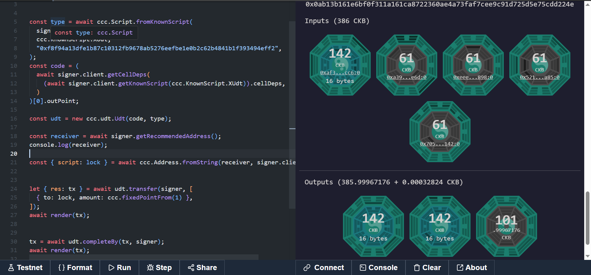

## Builder Track Weekly Report — Week 6

**Name:** Rebecca Ayodele
**Week Ending:** 04-30-2026

---

### Courses Completed

- **Handbook Reading & Study**:
  - [Nervos: An In-Depth Overview of a Blockchain Network Built for Modularity](https://www.nervos.org/knowledge-base/nervos_overview_of_a_layered_blockchain)
  - [A Deep Dive Into the Tokenomics of Nervos Network](https://www.nervos.org/knowledge-base/tokenomics_of_nervos_network)
  - [Common Knowledge Base: A Blockchain Developer's Dream](https://www.nervos.org/knowledge-base)
  - [Fiber Network Documentation](https://fiber.network/docs): payment channels on CKB
  - xUDT standard: how extensible user defined tokens differ from sUDT

- **Rust**:
  - Continued reading Rust book chapters 1–3 — variables, mutability, functions, control flow, error handling with `Result` and `match`

---

### Key Learnings

**From the reading this week:**

The tokenomics article was the most useful thing I read. CKB has a two-layer issuance model, primary issuance which is fixed like Bitcoin, and secondary issuance which is targeted specifically at state occupiers. Long-term CKB holders who aren't using storage can deposit into the Nervos DAO and receive a share of the secondary issuance, which effectively protects them from inflation. That's a design I hadn't seen on other blockchains and it makes sense for a preservation-focused layer 1.

The modular architecture overview helped connect what I've been building to the bigger picture. CKB is designed to be the secure base layer, validation and storage, while computation and high-throughput transactions happen on layer 2. That's directly why the transaction-oriented model makes sense: CKB optimises for verification, not execution.

The Fiber Network is a Lightning-compatible payment channel network on CKB that allows fast off-chain transactions that settle on CKB. This is relevant to where I want to take my project.

**From Rust reading:**

The `Result<T, E>` and `match` patterns are the most important concepts so far for CKB script writing. Every CKB script returns either success (0) or an error code that maps directly to Rust's `Result` type. Reading actual script code from previous weeks makes more sense now with this context.

---

### Practical Progress

**dApp — Multi-Recipient Transfer and Improved Transaction History**

I continued building on the CKB Transfer dApp from week 5. Features added this week:

- **Multi-recipient sending**: the form now supports adding and removing multiple recipients in a single transaction. Each recipient has their own address and amount field. All outputs are built at once and submitted in a single `sendTransaction` call
- **Improved transaction history UI**: each history entry shows a card with total amount sent, individual recipient addresses truncated, timestamp, and a clickable link to the Nervos Pudge testnet explorer
- **Balance refresh button**: manually refreshes CKB balance after sending without reloading the page

Screenshots for the dApp could not be taken this week due to a persistent OKX Wallet connection issue. The connector keeps redirecting to the OKX mobile deep link instead of using the browser extension. I am asking in the CKB developer community for help resolving this.

**xUDT Token Minting — CCC Playground**

I wrote a token minting transaction from scratch in the CCC playground. This is different from the transfer example in week 5 minting creates a brand new token where no prior inputs hold that token type. The token is identified by a unique hash tied to the transaction so it cannot be duplicated. The output cell required 142 CKB capacity more than a regular cell because it carries both the xUDT type script and 16 bytes of token data stored in little-endian format.

---

### Project Direction — CKB Wallet Dashboard

This week I decided on the project I want to build over the coming weeks: a **personal CKB wallet dashboard and transaction tracker**.

The gap I identified: the existing CKB block explorer shows everything for everyone. There is no personal dashboard that shows just your own activity in a clean, usable way. That's a real problem for anyone managing CKB assets without digging through a block explorer.

What it will include:
- Connect wallet and see your full CKB balance
- Pull complete on-chain transaction history — not just session history
- See all tokens you hold
- Send CKB and tokens from the same interface
- Clean UI built for real users not developers

This is a natural extension of the dApp I already have. The transaction logic is already working, the main new technical challenge is pulling on-chain history using the CKB indexer through CCC.

My plan combines my strengths:
- **Frontend**: Next.js
- **CKB/CCC**: transaction building and on-chain data I've been learning
- **Rust** — will come in when I need to write custom lock or type scripts, for example adding custom validation logic to the dashboard
- **AI** — spending insights or anomaly detection as a later addition

I will start with the on-chain transaction history feature next week as the first new addition.

---

### Challenges Faced

- OKX Wallet deep link issue blocking dApp testing — asking community for help
- Rust compiler not yet available locally — will resolve this week

---

### Reflection

This week was split between reading and building. The tokenomics and architecture reading connected the theory to what I've been building in a way that practical exercises alone don't. Understanding why CKB optimises for verification over execution makes the CCC transaction patterns feel less like following a template and more like working with a deliberate design decision.

The wallet dashboard project direction also became clear this week. It's a real gap, it uses what I already know, and it's something the CKB community can actually use.

---

### Next Week Plan

- Start building the CKB wallet dashboard — on-chain transaction history as first feature
- Resolve OKX Wallet connection issue with community help
- Run Rust code for the first time and complete chapter 1–3 exercises
- Read Rust book chapter 4 — Ownership
