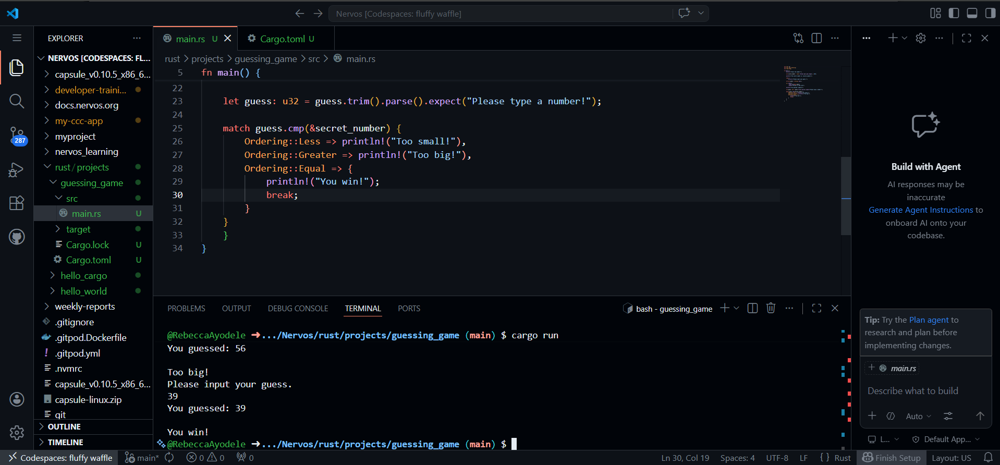
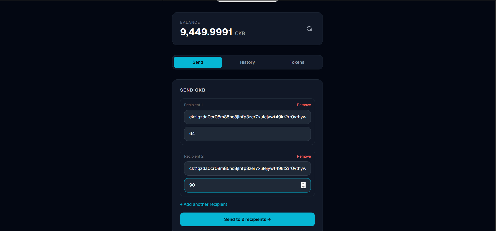
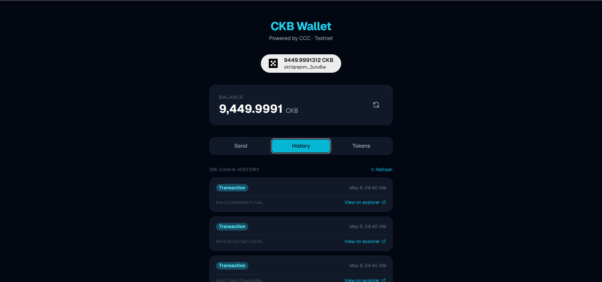

## Builder Track Weekly Report — Week 7

**Name:** Rebecca Ayodele
**Week Ending:** 05-07-2026

---

### Courses Completed

- **Rust Book**:
  - Chapter 4 — Ownership, borrowing and references
  - Ran the Chapter 2 guessing game project for the first time in Codespace

- **Handbook Reading**:
  - [Where we're going, we don't need Accounts: the Future of Onboarding](https://www.nervos.org/knowledge-base/account_abstraction_where_were_going)

- **CKB Wallet Dashboard — continued development**

---

### Key Learnings

**Rust — Ownership:**

Ownership is what makes Rust different from every other language. Instead of a garbage collector cleaning up memory automatically, Rust enforces rules at compile time about who owns a piece of data and when it gets freed. Every value has one owner, when the owner goes out of scope the value is dropped, and you can borrow a reference without taking ownership. This took a while to wrap my head around compared to JavaScript where you don't think about any of this.

The guessing game was the first time I actually ran Rust code after weeks of just reading it. Getting it to compile and run in Codespace made the syntax feel more real than reading alone.

**Account Abstraction on CKB:**

The article talks about how most blockchains make onboarding hard because users have to deal with seed phrases and wallet extensions before they can do anything. CKB handles this differently — because the lock script controls ownership, you can use any authentication method as a lock script. A fingerprint, passkey or even an Ethereum wallet can work on CKB without changing the protocol. JoyID is a real example of this — it uses biometrics as a lock script.

For the wallet dashboard, this matters because right now connecting requires an OKX browser extension which most people won't have. A custom lock script could change that later.

**CKB Indexer:**

Pulling on-chain history works by passing your lock script to `findTransactions` — the indexer returns every transaction where that lock script appears. Token detection works the same way — scan your live cells, check if any have a type script attached, and read the balance from the cell data.

---

### Practical Progress

**Rust — Guessing Game**

Ran the guessing game from Rust Book Chapter 2 in Codespace. The program generates a random number, takes user input and handles invalid input without crashing.

**CKB Wallet Dashboard — New Features**

Features added this week:

- **Three-tab layout** — Send, History and Tokens tabs with active state styling
- **On-chain transaction history** — pulls the last 10 real transactions from the CKB indexer using the wallet's lock script, each card shows a truncated transaction hash and a clickable explorer link to Nervos Pudge
- **Multi-recipient sending** — add and remove recipient fields dynamically, all outputs built in a single transaction
- **Token detection** — scans live cells for type scripts and reads UDT balances from cell data
- **Token minting** — mint button in the Tokens tab creates a new xUDT token directly from the wallet

---

### Challenges Faced

- Token minting confirmation goes through OKX wallet correctly but minted tokens are not showing up in the Tokens tab — needs further debugging
- On-chain transaction timestamps not directly available from the indexer — fetching accurate timestamps requires additional block header requests
- Rust compiler not available locally due to ARM processor — all Rust code runs in Codespace

---

### Reflection

Getting Rust code to actually run for the first time made the concepts from the earlier chapters feel more grounded. The account abstraction reading also changed how I think about the wallet project — what looks like a UX problem is actually solvable at the protocol level through custom lock scripts, which is a longer term direction worth exploring.

---

### Next Week Plan

- Awaiting guidance from programme director on recommended reading order given current progress
- Continue Rust — Chapters 5 and 6 (Structs, Enums and match)
- Debug token detection in the Tokens tab
