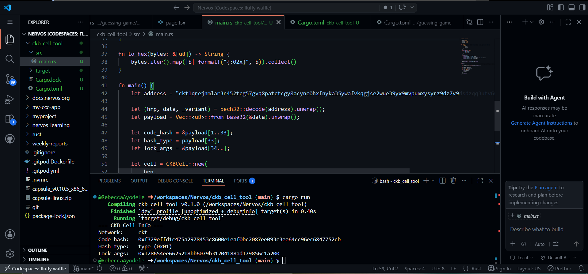
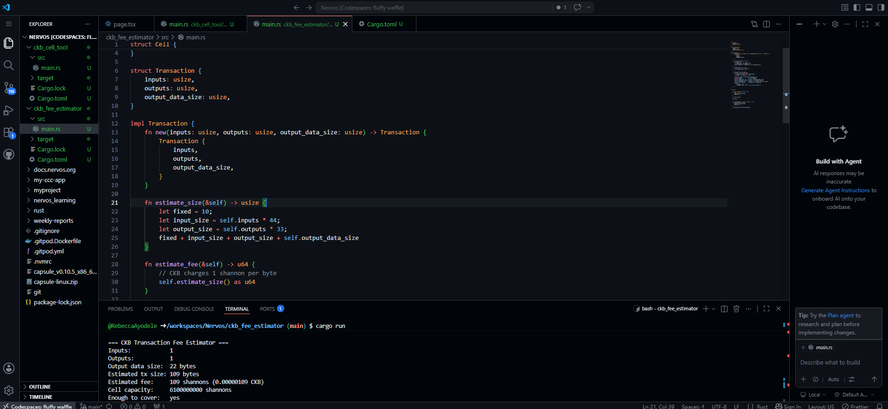

## Builder Track Weekly Report — Week 8

**Name:** Rebecca Ayodele
**Week Ending:** 05-14-2026

---

### Courses Completed

- **Rust Book**:
  - Chapters 5 and 6 — Structs, Enums and match

- **RFC Reading**:
  - [RFC-0021: CKB Address Format](https://github.com/nervosnetwork/rfcs/blob/master/rfcs/0021-ckb-address-format/0021-ckb-address-format.md)
  - [RFC-0022: Transaction Structure](https://github.com/nervosnetwork/rfcs/blob/master/rfcs/0022-transaction-structure/0022-transaction-structure.md)
  - [RFC-0019: Data Structures](https://github.com/nervosnetwork/rfcs/blob/master/rfcs/0019-data-structures/0019-data-structures.md)

---

### Key Learnings

**Rust — Structs and Enums:**

Structs let you group related data into a single named type and attach behaviour to it via `impl`. Enums and `match` work together to handle different cases explicitly — the compiler forces you to cover every possibility which makes the logic harder to get wrong. Both came into use directly in the projects this week.

**RFC-0021 — CKB Address Format:**

CKB addresses are bech32m encoded. The payload structure contains information about the lock script and lock args used by the address. The lock args correspond to the blake160 of the public key and uniquely identify the address owner. Hash type 0x01 represents a type hash. During implementation and verification against the Pudge explorer, I discovered that my assumption about the payload layout may not fully match the actual RFC-0021 short address format used on testnet, particularly regarding how the code hash is represented.

---

### Practical Progress

**ckb_cell_tool**

A Rust CLI that decodes a real CKB testnet address into its components. It uses the bech32 crate to decode the address payload and models the result using a CKBCell struct with a summary() method.

The tool successfully extracted the hash type and lock args from the address. The extracted lock args matched the values shown on the Pudge explorer for the same wallet address.

While verifying the results against the explorer, I found that the extracted code hash did not match the actual secp256k1 lock script code hash shown on-chain. This suggests that my current parsing logic may be incorrectly interpreting part of the RFC-0021 payload structure, especially for short-format addresses where the full code hash may not be embedded directly in the address payload.

**ckb_fee_estimator**

A Rust CLI that estimates transaction fees based on real CKB fee rules — 1 shannon per byte of transaction size. It defines a `Transaction` struct with input count, output count and output data size, calculates the estimated size using CKB's size breakdown per field, then checks whether a given cell has enough capacity to cover the fee. Two scenarios were tested — a plain transfer and a transaction storing 22 bytes of data.

---

### Challenges Faced

- The `bech32` 0.9 API requires `FromBase32` to be imported explicitly as a trait before `.from_base32()` can be called — leaving it out produces a compile error that is not immediately obvious from the message.

---

### Reflection

Building in pure Rust this week without CCC or TypeScript made the lower level details more visible. The fee estimator in particular made it clear what `completeFeeBy` is doing automatically — transaction size is deterministic based on structure, and the fee follows from that. The RFC reading also gave the cell and transaction structures more context beyond what comes through the SDK.

---

### Next Week Plan

- Continue Rust — Chapters 7 and 8
- Read further into the Nervos RFCs, particularly around script execution and the VM
- Attempt the Create DOB beginner task using the Spore protocol in Codespace