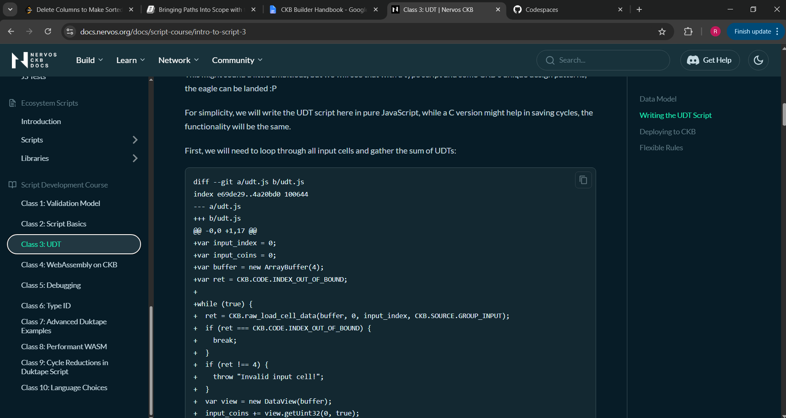
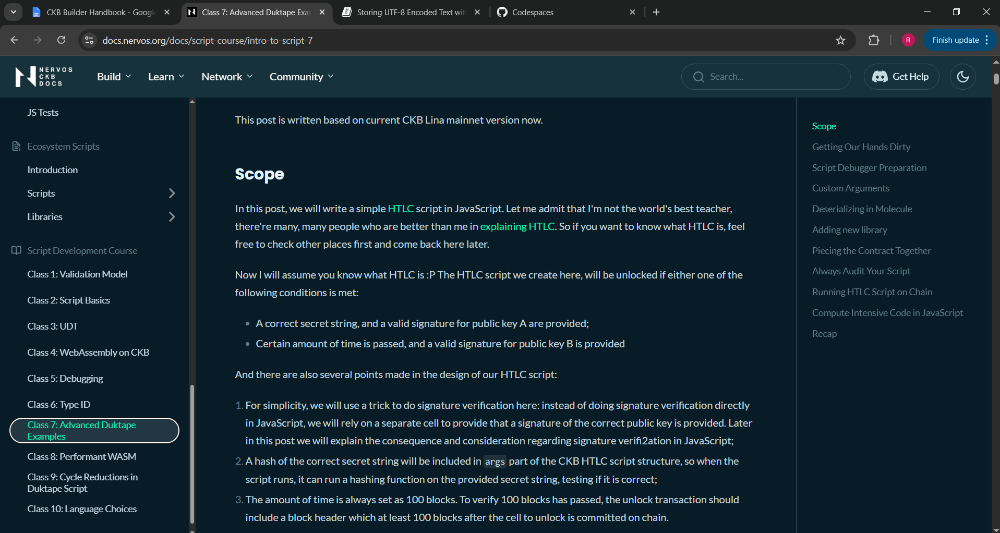

## Builder Track Weekly Report — Week 9

**Name:** Rebecca Ayodele
**Week Ending:** 05-21-2026

---

### Courses Completed

- **Script Development Course**:
  - [Class 3: UDT](https://docs.nervos.org/docs/script-course/intro-to-script-3)
  - [Class 4: WebAssembly on CKB](https://docs.nervos.org/docs/script-course/intro-to-script-4)
  - [Class 5: Debugging](https://docs.nervos.org/docs/script-course/intro-to-script-5)
  - [Class 6: Type ID](https://docs.nervos.org/docs/script-course/intro-to-script-6)
  - [Class 7: Advanced Duktape Examples](https://docs.nervos.org/docs/script-course/intro-to-script-7)

- **Rust Book**:
  - Chapter 7 — Packages, Crates, and Modules
  - Chapter 8 — Common Collections

---

### Key Learnings

**Class 3 — UDT:**

UDT stands for user defined token. The common use is for a token issuer to create tokens with a specific purpose. CKB takes a different approach to storing balances compared to Ethereum. In Ethereum you store everyone's balances in one contract, but in CKB if you try to do the same thing with a single cell, two problems come up: storage gets expensive as the number of users grows, and since updating a cell in CKB means destroying the old one and creating a new one, everyone trying to update the same cell at the same time creates a bottleneck.

So CKB stores each user's tokens in their own cell. The first 4 bytes of the cell data hold the token amount. Storage cost stays constant regardless of how many tokens are in the cell, and users can transfer all or part of their tokens. Many people can hold the same token type, each in their own separate cell.

To prevent fake tokens, a type script enforces that total input tokens equal total output tokens in any transaction. For the initial minting, the issuer uses an OutPoint as the script args. Since an OutPoint can only be spent once, nobody can reuse it to mint again. Normal users can only transfer, only the issuer can do the first creation, and nobody can replicate that OutPoint.

**Class 4 — WebAssembly on CKB:**

RISC-V was chosen over WebAssembly for CKB's VM because it operates at a lower level. Because of that lower level, WebAssembly programs can actually run on CKB VM by converting them to RISC-V first. The downside is performance — the conversion is slower than writing directly in RISC-V and some optimizations are lost in the process.

**Class 5 — Debugging:**

Two approaches are covered. The first is debugging with GDB — you compile your script with `-g` to include debugging information, then use the standalone CKB debugger to step through a failed transaction like a normal program. The second is a REPL-based workflow using ckb-duktape, where you type JavaScript directly into a running CKB environment and interact with it in real time. Both require tooling I don't have set up yet but the concepts are clear.

**Class 6 — Type ID:**

The problem Type ID solves is the usual tradeoff in blockchain: if contracts can be upgraded, users lose security because the behaviour can change. If they can't be upgraded, bugs can't be fixed. CKB handles this with Type ID — a unique type script created using an OutPoint that allows a script to be updated while its identifier stays the same. Developers can make upgradeable contracts, and users who prefer fixed behaviour can lock to a specific version.

**Class 7 — Advanced Duktape Examples:**

This class shows how JavaScript smart contracts run on CKB using the Duktape engine. Scripts are not limited to simple validation — developers can use JavaScript libraries, handle blockchain data, hash data, and serialize using Molecule. The HTLC example stood out: funds can be unlocked with a secret string or claimed after a timeout. Witnesses, script args, and Molecule serialization are used to pass data securely inside transactions.

**Rust — Chapter 7:**

As projects grow, putting everything in one file stops making sense. Rust uses packages, crates, and modules to organize code. The part that was confusing at first was the difference between a package and a crate — a package is the whole project managed by Cargo, a crate is the actual compiled unit inside it. A crate is either a binary crate (an executable) or a library crate (shared code). Modules control what is public or private — Rust hides everything by default, so `pub` is needed to expose things. The `use` keyword shortens long paths and `pub use` re-exports items.

**Rust — Chapter 8:**

Collections in Rust can grow or shrink at runtime unlike arrays. Vectors store multiple values of the same type — `.get()` returns an `Option` instead of crashing on invalid access. Strings are UTF-8 encoded so they can't be indexed directly like arrays, you have to use `.chars()` or `.bytes()`. Hash maps store key-value pairs similar to objects in JavaScript, but ownership rules apply when inserting — inserting a value can move ownership depending on the type.

---

### Practical Progress

No new builds this week. I went back over the ckb_cell_tool and ckb_fee_estimator code from week 8 so I wouldn't lose track of how Rust connects to CKB concepts while focusing on reading.

---

### Challenges Faced

Classes 4 and 5 require Docker and a RISC-V compiler toolchain to run the examples. That setup is not available in my environment so both were reading only.

---

### Reflection

Class 3 was the most useful thing I read this week. The OutPoint-as-args pattern for preventing token forgery is something I had seen when working on xUDT minting in the dashboard but didn't fully understand until now. Class 4 also helped — RISC-V versus WebAssembly comes up a lot in the CKB ecosystem and it's good to have a clearer answer for why that choice was made.

---

### Next Week Plan

- Classes 8–10 of the script development course
- Begin the Detailed JS scripting quick start
- Start the Create DOB beginner task using the Spore SDK in Codespace